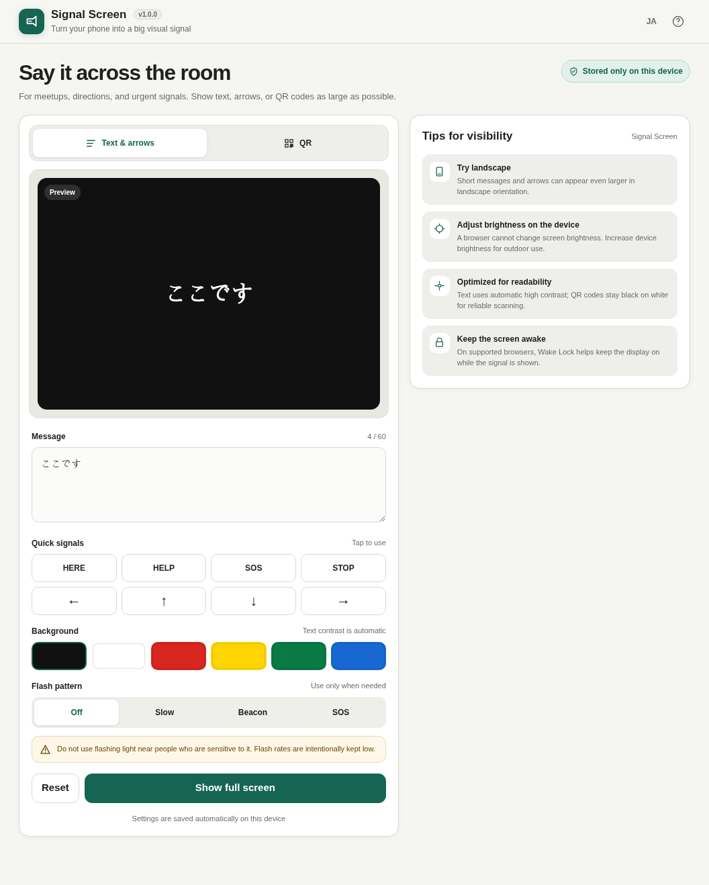

# Signal Screen

[](https://github.com/ttomohisa/htmlapps-signal-screen/actions/workflows/deploy-pages.yml)
[](LICENSE)
[](https://ttomohisa.github.io/htmlapps-signal-screen/)

[日本語版 README](README.ja.md)

A privacy-focused single-HTML app that turns a phone or computer display into a large visual signal using text, arrows, colors, and QR codes. It is designed for meetups, event guidance, travel, and other situations where you temporarily need a highly visible screen without installing an app.

## 🚀 Live demo

### [Open Signal Screen on GitHub Pages](https://ttomohisa.github.io/htmlapps-signal-screen/)

GitHub Pages delivers the initial HTML. After it loads, text display, QR generation, and settings persistence are processed locally on the device. The app does not upload your message or QR content.

[](https://ttomohisa.github.io/htmlapps-signal-screen/)

[Smartphone screenshot](assets/screenshot-mobile.png)

## Features

- Auto-fit a message to fill the available screen
- Quick presets for HERE, HELP, SOS, and STOP
- Large `←` `↑` `↓` `→` direction arrows
- Black, white, red, yellow, green, and blue backgrounds
- Automatic black/white text contrast based on the background
- One-tap **Text & arrows / QR** mode switching
- Generate QR codes locally from URLs or short UTF-8 text
- Fixed black modules, white background, and quiet zone for reliable QR scanning
- Flashing is automatically disabled in QR mode
- Steady, Slow, Beacon, and SOS display patterns
- First-use safety confirmation before enabling flashing
- Flashing automatically disabled when `prefers-reduced-motion` is enabled
- Fullscreen API support
- Screen Wake Lock on supported browsers
- Japanese and English in the same HTML
- LocalStorage persistence for messages, QR content, colors, and settings
- Responsive desktop and smartphone layouts
- Readable and gzip self-extracting single-HTML release variants

## Display controls and reset

- Pin controls keeps display controls visible, including after background taps. Unpin resumes auto-hide while respecting keyboard focus and open dialogs. Pinning resets when the display closes.
- Keep awake is requested when each display session opens. Turning it off stays off when you return to the tab; turn it back on explicitly to retry. A browser-released lock can be reacquired on return while keep-awake is still requested.

- Tab and Shift+Tab stay within display controls; focused controls remain visible. Closing the display returns focus to Show full screen.
- Escape dismisses an open confirmation first; a subsequent Escape closes the display.
- Reset asks before restoring the localized HERE message, black background, steady display, and Text & arrows mode. It clears QR content and the flashing acknowledgement but keeps the selected language. Cancel changes nothing.

## Quick start

No account or server-side storage is required. Messages and settings stay inside the browser.

### Use the web demo

Just [open the demo](https://ttomohisa.github.io/htmlapps-signal-screen/). No installation or account is required.

### Use the downloaded HTML

Download [`dist/index.html`](https://github.com/ttomohisa/htmlapps-signal-screen/blob/main/dist/index.html) and open it in a current Chromium-based browser, Firefox, or Safari.

Core text, arrow, and QR features are designed to work when the normal HTML is opened directly with `file://`. Fullscreen and Screen Wake Lock can depend on the browser and security context.

### Use the self-extracting variant

`dist/index.self-extract.html` contains a gzip-compressed copy of the readable HTML. The browser expands it locally and starts Signal Screen without a network request.

The self-extracting variant requires `DecompressionStream`. Its loader is intentionally ASCII-only for Windows PowerShell 5.1 compatibility and automatically inherits the favicon embedded in the normal HTML.

## Usage

### Show text or arrows

1. Select **Text & arrows**.
2. Enter a message or choose a HERE, SOS, or direction preset.
3. Choose a background when needed.
4. Enable Slow, Beacon, or SOS flashing only when the situation calls for it.
5. Press **Show full screen**.
6. Tap the stage to hide or reveal the controls.

Text is automatically resized to fit the stage. Short messages and arrows can become even larger when a phone is rotated to landscape.

### Show a QR code

1. Select **QR**.
2. Enter a URL or short text.
3. The QR preview updates immediately.
4. Press **Show full screen** to maximize the QR code for scanning.

QR generation happens entirely on the device. QR mode keeps a fixed black-on-white design and disables flashing to prioritize scanning reliability. The current input limit is 300 UTF-8 bytes.

### Flash patterns

Use flashing only when necessary. Signal Screen shows an in-app safety confirmation the first time a non-steady pattern is selected.

- **Slow:** low-frequency alternating visibility.
- **Beacon:** a low-speed attention pattern.
- **SOS:** a visual pattern inspired by `... --- ...`.

Signal Screen does not provide a high-frequency strobe. If `prefers-reduced-motion` is enabled, flashing is forced back to Steady.

## Publish with GitHub Pages

This repository includes a workflow that builds, verifies, and deploys the standalone HTML to GitHub Pages.

1. Push the repository to GitHub as `htmlapps-signal-screen`.
2. Open **Settings → Pages → Build and deployment → Source** and select **GitHub Actions**.
3. Push to `main`, or manually run **Deploy standalone app to GitHub Pages** from the Actions tab.
4. After a successful deployment, the app is available at `https://ttomohisa.github.io/htmlapps-signal-screen/`.

If GitHub Pages has not been enabled yet, the workflow still builds the HTML but skips the Pages deployment and writes setup instructions to the workflow summary. Enable Pages once, then re-run the workflow.

## Development and build layout

```text
.
├─ src/index.template.html             # Application source
├─ app.config.json                     # Name, version, and build settings
├─ dependencies.json                   # Build dependency definition
├─ build-standalone.bat                # Windows build entry point
├─ build-standalone.ps1                # Readable standalone builder
├─ scripts/
│  ├─ build-self-extract.ps1           # Self-extracting variant builder
│  ├─ verify-standalone.ps1            # Readable HTML verification
│  ├─ verify-self-extract.ps1          # Self-extract verification
│  └─ check-repository.ps1             # Repository-level validation
├─ dist/
│  ├─ index.html                       # Readable standalone release
│  └─ index.self-extract.html          # Gzip self-extracting release
└─ .github/workflows/
   ├─ build-standalone.yml             # Pull request validation
   └─ deploy-pages.yml                 # Automatic Pages deployment
```

### Build on Windows

```powershell
.\build-standalone.ps1
```

To run repository-level validation as well:

```powershell
powershell.exe -NoLogo -NoProfile -ExecutionPolicy Bypass -File .\scripts\check-repository.ps1
```

The build verifies that:

- No unresolved build placeholders remain
- No external script, stylesheet, frame, or CSS asset URLs remain
- The CSP contains `connect-src 'none'`
- The self-extract loader remains ASCII-only
- The self-extract variant inherits the readable HTML favicon
- The gzip payload restores byte-for-byte to the readable HTML

## Privacy and runtime network protection

Signal Screen is local-first.

- Messages and QR contents are processed only inside the browser
- Persistence uses LocalStorage only
- QR generation is entirely local
- No account is required
- No analytics or telemetry
- No server API
- Runtime CSP includes `connect-src 'none'`

The GitHub Pages version needs an initial request to download the HTML, but Signal Screen does not transmit user-entered content during runtime.

## Safety and limitations

- Flashing screens can cause discomfort or health effects for some people. Do not use flashing light near people who are sensitive to it.
- Signal Screen does not provide a high-frequency strobe, but it is not a medical or certified safety device.
- **It is not a substitute for certified emergency, road, maritime, or aviation signaling equipment.**
- Browsers cannot change device screen brightness. Adjust brightness using the device controls for outdoor use.
- Fullscreen and Screen Wake Lock availability depends on the browser and security context.
- QR input is limited to 300 UTF-8 bytes. Denser QR codes can be harder to scan from a distance.
- QR color customization and flashing are intentionally unsupported to prioritize scan reliability.
- Clearing browser LocalStorage also removes saved Signal Screen content and settings.

## Dependencies

| Library | Version / source | License | Purpose |
| --- | --- | --- | --- |
| QRCode for JavaScript | Kazuhiko Arase source, adapted from the copy vendored by `qrcode-terminal` 0.12.0 | MIT | QR generation |

The embedded QR implementation is modified to support UTF-8 input and is included directly in the single HTML. No third-party runtime library is downloaded from the network. See [THIRD_PARTY_NOTICES.md](THIRD_PARTY_NOTICES.md) for details.

## Contributing

Bug reports and feature proposals are welcome through GitHub Issues. See [CONTRIBUTING.md](CONTRIBUTING.md) for development guidance.

## License

Copyright © 2026 ttomohisa

Licensed under the [MIT License](LICENSE).
